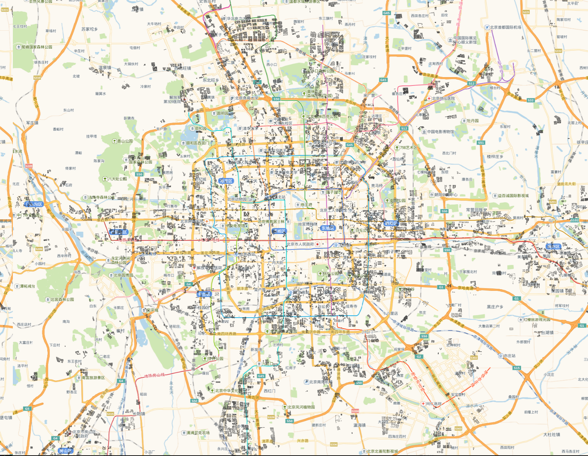

# SleepHealth: Urban Residential Sleep-Period Thermal Comfort under Climate Change

## Purpose

The data and code in this repository support the **peer review** of the manuscript submitted to *Nature Cities*:

**Building-mediated heat exposure threatens urban sleep comfort in a warming climate**

The manuscript describes the code functionality in the Methods section.

The materials are provided so that reviewers and future users can inspect the numerical workflow, reproduce the released Beijing case, and examine the processed source data supporting the manuscript figures.

The core executable reproduction is a **three-stage post-processing pipeline**. It starts from existing EnergyPlus simulation outputs and calculates Standard Effective Temperature (SET), sleep-period thermal-discomfort hours, population-weighted summaries, cooling-energy demand, installed cooling capacity, and coincident cooling peaks.

## Workflow overview

The released Beijing computational workflow is:

```text
EnergyPlus simulation outputs used as post-processing inputs
        ↓
Step 1: SET and sleep-period thermal-discomfort calculation
        ↓
Step 2: Total and per-capita analysis-ready pivot tables
        ↓
Step 3: Cooling-energy, installed-capacity, and coincident-peak summaries
```

| Stage | Description |
|---|---|
| **EnergyPlus simulation outputs** | Hourly indoor-environment outputs, cooling-energy meters, and cooling-capacity reports generated before the public post-processing workflow. |
| **Step 1** | Reconstructs indoor relative humidity, calculates hourly SET, identifies sleep-period discomfort, and produces population-weighted per-capita results. |
| **Step 2** | Converts Step 1 outputs into analysis-ready total and per-capita pivot tables. |
| **Step 3** | Summarizes cooling-energy use, installed capacity, valid cooling hours, and coincident peak cooling loads. |

## Data availability and public-release scope

The manuscript evaluates six Chinese megacities: Beijing, Shanghai, Guangzhou, Shenzhen, Wuhan, and Xiamen. The executable city-scale post-processing reproduction is provided for **Beijing**, with processed source data supporting the six-city manuscript figures.

The Beijing EnergyPlus simulation outputs required for the released reproduction are included directly in this GitHub repository as compressed scenario archives. Processed source data supporting the six-city manuscript figures are retained in the same repository where applicable.

| Material | Public location | Scope |
|---|---|---|
| Three-stage post-processing code | GitHub repository | Beijing executable reproduction |
| Quick demo subset | `demo/data/` | One Beijing archetype, 2020 scenario; demonstrates the workflow |
| EnergyPlus simulation outputs used as post-processing inputs | `code/data/energyplus_outputs/` (compressed ZIP archives) | Beijing only |
| Building and population lookup tables | `code/data/supporting_data/` | Beijing only |
| Beijing residential-building shapefile | `figure/figure2/c/BJ-shp/` | Beijing only; spatial inspection and source-data transparency |
| Figure source data | `figure/figure2/`–`figure/figure6/` | Processed tables and files supporting manuscript panels |
| Rendered manuscript panels | `figure/figure2/`–`figure/figure6/` | Provided for inspection and comparison |
The executable supporting-data directories contain the Beijing ClusterMap and population inputs used by the workflow. The Beijing residential-building shapefile is provided for spatial inspection and source-data transparency.

## Beijing building data preview



The image above previews the released Beijing residential-building dataset.

## Repository layout

```text
SleepHealth/
├── LICENSE
├── README.md
├── requirements.txt
├── beijing_buildings_preview.png
├── demo/
│   ├── run_demo.py
│   └── data/                           # Small in-repository demo subset
├── code/
│   ├── run_all.py
│   ├── code/
│   │   ├── step1_compute_set.py
│   │   ├── step2_pivot_tables.py
│   │   ├── step3_energy_capacity.py
│   │   ├── config/
│   │   │   ├── parameters.py
│   │   │   └── paths.py
│   │   └── core/
│   │       ├── city_matcher.py
│   │       ├── excel_exporter.py
│   │       └── set_calculator.py
│   ├── data/
│   │   ├── energyplus_outputs/
│   │   │   ├── README.md
│   │   │   ├── IndoorEnv/              # Seven scenario ZIP archives
│   │   │   ├── Energy/                 # Seven scenario ZIP archives
│   │   │   └── Capacity/               # Seven scenario ZIP archives
│   │   ├── epw/                        # Seven Beijing EPW files
│   │   └── supporting_data/
│   │       ├── ClusterMap/
│   │       └── Population/
│   └── output/                         # Generated automatically after execution
└── figure/
    ├── figure2/
    │   └── c/
    │       └── BJ-shp/                  # Single released Beijing shapefile
    ├── figure3/
    ├── figure4/
    ├── figure5/
    │   └── b/                           # Seven compressed hourly source archives + field description
    └── figure6/
```

The `code/output/` directory is generated automatically during execution.

The `figure/` directory contains processed figure source data and rendered panels.

## Compressed Beijing EnergyPlus inputs

The Beijing EnergyPlus simulation outputs required to run the three-stage pipeline are included directly in this GitHub repository under:

```text
code/data/energyplus_outputs/
```

Each climate-scenario directory is distributed as an individual ZIP archive inside `IndoorEnv/`, `Energy/`, and `Capacity/`. Before running the workflow, extract the archives **in place** so that the corresponding scenario directories are restored.

For example:

```text
code/data/energyplus_outputs/Capacity/2020.zip
    → code/data/energyplus_outputs/Capacity/2020/

code/data/energyplus_outputs/Energy/2040-SSP1-2.6.zip
    → code/data/energyplus_outputs/Energy/2040-SSP1-2.6/
```

The same seven scenario names are used under all three input categories:

```text
2020/
2040-SSP1-2.6/
2040-SSP2-4.5/
2040-SSP5-8.5/
2060-SSP1-2.6/
2060-SSP2-4.5/
2060-SSP5-8.5/
```

Directory names and filename suffixes must not be changed after extraction. The extracted scenario folders must preserve the internal file organization expected by the released scripts.

| Folder | Contents |
|---|---|
| `IndoorEnv/` | Hourly zone air temperature, mean radiant temperature, humidity ratio, and schedule outputs used by Steps 1 and 3 |
| `Energy/` | Cooling-electricity meter outputs used by Step 3 |
| `Capacity/` | Cooling-system sizing reports used by Step 3 |

## Core-model organization

| Item | Role |
|---|---|
| `code/run_all.py` | Runs Steps 1–3 sequentially and stops if a stage fails |
| `code/code/step1_compute_set.py` | Calculates hourly SET and sleep-period discomfort and performs population-weighted aggregation |
| `code/code/step2_pivot_tables.py` | Produces analysis-ready total and per-capita pivot tables |
| `code/code/step3_energy_capacity.py` | Summarizes cooling energy, installed capacity, represented building counts, and coincident peaks |
| `code/code/config/parameters.py` | Stores fixed SET parameters, sleep-period timestamps, strategies, and scenario definitions |
| `code/code/config/paths.py` | Resolves repository-relative input and output paths |
| `code/code/core/` | Shared calculation, city-matching, and Excel-export utilities |
| `code/data/supporting_data/ClusterMap/` | Beijing building identifiers, prototype assignments, floor counts, and related lookup fields |
| `code/data/supporting_data/Population/` | Beijing building-level population inputs used for population-weighted aggregation |
| `demo/run_demo.py` | Runs the same pipeline on the small in-repository demo subset |

`Fnum`, `LandNum`, and `Cluster` are read from the ClusterMap table. Population tables contribute building identifiers and population values only, so the merged dataset retains the canonical field name `Fnum` rather than generated suffixes such as `Fnum_x` or `Fnum_y`.

## Python environment

Python 3.10 or later is recommended.

Install the core Beijing workflow dependencies from the repository root:

```bash
python -m venv .venv
```

On some Windows systems, use `py -m venv .venv` if `python` is not available.

Windows:

```bash
.venv\Scripts\activate
```

Linux or macOS:

```bash
source .venv/bin/activate
```

Then install the dependencies:

```bash
pip install -r requirements.txt
```

The principal core-workflow dependencies are:

```text
numpy>=1.24,<3
pandas>=1.5,<3
pythermalcomfort==3.7.1
openpyxl>=3.1
XlsxWriter>=3.1
```

`pythermalcomfort` 3.7.1 also installs `scipy` and `numba`. The bundled Beijing EnergyPlus archives were generated with EnergyPlus 23.2.0.


### Tested environment

The quick demo was executed in this environment after a clean virtual-environment installation:

- Microsoft Windows 11 Pro, 64-bit (build 10.0.26200)
- Python 3.11.6
- numpy 2.4.6
- pandas 2.3.3
- pythermalcomfort 3.7.1
- openpyxl 3.1.5
- XlsxWriter 3.2.9

The released workflow uses Python 3.10+ and the packages listed above.

### Hardware requirements

The released Beijing workflow runs on a standard CPU-based workstation.

### Typical installation time

Typical installation time for the core Beijing workflow: approximately 2 minutes in the tested environment (creating a virtual environment and installing `requirements.txt`). The measured elapsed time was 97 seconds.

## Quick demo

`demo/data/` contains a small real subset of the released Beijing files: one IndoorEnv CSV, one Energy meter CSV, and one Capacity HTML report for `bei3jing1shi4_0_1_1980_S0`, plus one matching ClusterMap row and one matching population row. Atmospheric pressure is read from the existing Beijing 2020 EPW file in `code/data/epw/`.

These files demonstrate the software interface and workflow.

From the repository root, after installation:

```bash
python demo/run_demo.py
```

A successful run prints `[OK] Demo completed` and writes:

```text
demo/output/set_calculations/summary_uncomfortable_hours.csv
demo/output/per_capita_hours/per_capita_hours_summary.csv
demo/output/pivot_tables/total_uncomfortable_hours_pivot.xlsx
demo/output/pivot_tables/per_capita_hours_pivot.xlsx
demo/output/energy_capacity/energy_capacity_summary.csv
demo/output/energy_capacity/coincident_peak_load.csv
```

In the tested environment, the demo produced one `STOREY_0` summary row for `bei3jing1shi4_0_1_1980_S0` under `2020 Baseline` / S1.

Typical demo runtime: approximately 20 seconds in the tested environment. The measured elapsed time was 17 seconds.

## Running the Beijing reproduction

### 1. Extract the bundled EnergyPlus simulation outputs

The required Beijing EnergyPlus outputs are already included in the GitHub repository as ZIP archives. Extract all seven scenario archives in each of the following directories before running the pipeline:

```text
code/data/energyplus_outputs/IndoorEnv/
code/data/energyplus_outputs/Energy/
code/data/energyplus_outputs/Capacity/
```

After extraction, each directory should contain the seven scenario folders listed above.

### 2. Confirm the supporting data

The Beijing lookup tables should remain under:

```text
code/data/supporting_data/ClusterMap/
code/data/supporting_data/Population/
```

### 3. Run the complete pipeline

From the repository root, execute:

```bash
python code/run_all.py
```

The runner executes the three stages in sequence. A nonzero return code from any stage stops the workflow immediately.

## Step-by-step execution

### Step 1 — SET and sleep-period thermal discomfort

```bash
python code/code/step1_compute_set.py
```

Principal operations:

1. read hourly indoor-environment outputs;
2. reconstruct indoor relative humidity from dry-bulb temperature, humidity ratio, and atmospheric pressure;
3. calculate hourly SET using `pythermalcomfort` 3.7.1;
4. identify intervals with SET greater than 30 °C during the defined sleep period;
5. aggregate floor-level results to buildings and population-weighted city-level indicators.

Principal outputs:

```text
code/output/set_calculations/summary_uncomfortable_hours.csv
code/output/per_capita_hours/per_capita_hours_summary.csv
```

### Step 2 — Total and per-capita analysis-ready pivot tables

```bash
python code/code/step2_pivot_tables.py
```

Principal outputs:

```text
code/output/pivot_tables/total_uncomfortable_hours_pivot.xlsx
code/output/pivot_tables/per_capita_hours_pivot.xlsx
```

### Step 3 — Energy, capacity, and coincident peak

```bash
python code/code/step3_energy_capacity.py
```

Principal outputs:

```text
code/output/energy_capacity/energy_capacity_summary.csv
code/output/energy_capacity/coincident_peak_load.csv
```

## Running on your own compatible data

The released workflow uses a fixed research input schema and can be applied to compatible datasets that follow the same layout and naming conventions.

Place compatible files in the same relative structure, or point the pipeline to another tree.

Windows (Command Prompt):

```bat
set MODEL_DATA_ROOT=path\to\your_data
set MODEL_OUTPUT_ROOT=path\to\your_output
set BASE_EPW=path\to\your_epw
python code/run_all.py
```

Windows (PowerShell):

```powershell
$env:MODEL_DATA_ROOT="path\to\your_data"
$env:MODEL_OUTPUT_ROOT="path\to\your_output"
$env:BASE_EPW="path\to\your_epw"
python code/run_all.py
```

macOS/Linux:

```bash
export MODEL_DATA_ROOT=/path/to/your_data
export MODEL_OUTPUT_ROOT=/path/to/your_output
export BASE_EPW=/path/to/your_epw
python code/run_all.py
```

Optional overrides: `BASE_INDOOR`, `BASE_ENERGY`, `BASE_CAPACITY`, `BASE_CLUSTER`, `BASE_POP`.

Required inputs:

1. **IndoorEnv CSV** — hourly EnergyPlus outputs named `{city_pinyin}_{LandNum}_{Cluster}_{year}_{Sx}.csv`, stored under `{scenario}/`. Required columns include `Date/Time` (`MM/DD  HH:00:00`, retaining `24:00:00`), `Zone Air Temperature`, `Mean Radiant Temperature`, `Humidity Ratio`, `HVAC_CONDITIONEDTIME_SCHEDULE`, and `COOLING_PERIOD_SCHEDULE`.
2. **Energy meter CSV** — companion `{id}-meter.csv` with `Electricity:Facility` and `Electricity:Building`.
3. **Capacity HTML** — companion `{id}-table.htm` containing `Coil:Cooling:DX:SingleSpeed` and `STOREY n ... COOLING COIL` rows.
4. **ClusterMap** — `cluster_{citycode}_{City}.xlsx` or `.csv` with `BuildingID`, `Fnum`, `Cluster`, and `LandNum`. If `landUseTyp` is present, only rows starting with `Residential` are used.
5. **Population table** — `{citycode}_{City}_full.xlsx` or `.csv` with `BuildingID` and a population field (`Population`, `popNum_2`, or an equivalent alias).
6. **EPW file** — one city/scenario EPW whose filename or path matches the city and scenario tokens. Step 1 uses EPW field 10 (atmospheric pressure).

Recognised city prefixes include `bei3jing1shi4`. Recognised scenario folders are the seven names listed above. For 2020 files, filename suffix `S0` is treated as strategy S1. Future files use zero-based suffixes `S0`–`S4` for S1–S5 unless `FLAT_STRATEGY_INDEX_BASE` is set.

Building identifiers in EnergyPlus filenames must encode `_{LandNum}_{Cluster}_` so that floor-level results can be matched to ClusterMap `Fnum`. Outputs use the same filenames as the Beijing reproduction, written under `MODEL_OUTPUT_ROOT`.

## SET and sleep-period settings

The released calculation uses the following settings and released analysis period:

| Parameter | Value |
|---|---:|
| Metabolic rate | 0.7 met |
| Clothing and bedding insulation | 0.8 clo |
| Indoor air velocity | 0.1 m s⁻¹ |
| Relative-humidity upper limit | 60% |
| Atmospheric pressure | City- and scenario-specific pressure read from the matching EPW file |
| SET discomfort threshold | 30 °C |
| Analysis season represented by the released inputs | May–October |
| Sleep period represented | 22:00–07:00 |
| EnergyPlus interval-ending timestamps | 23:00, 24:00, and 01:00–07:00 |

Step 1 reads city/scenario-specific atmospheric pressure from the matching EPW file under `code/data/epw/`.

The released hourly simulation outputs span the May–October analysis period. The calculation evaluates the **22:00–07:00** sleep period using the cooling-period and HVAC-conditioned-time schedules contained in the EnergyPlus outputs.

The original EnergyPlus CSV files contain `24:00:00` rather than `00:00:00`; therefore, `24` is retained during the calculation. When results are exported to Excel, `24:00` may be displayed as `00:00` on the following calendar day, which is expected and does not alter the represented interval.

## Cooling strategies

| Strategy | Capacity assumption | Operating condition |
|---|---|---|
| **S1** | Fixed | Nighttime cooling at 27 °C |
| **S2** | Fixed | All-day cooling: 32 °C during daytime and 27 °C during nighttime |
| **S3** | Fixed | Nighttime cooling at 26 °C |
| **S4** | Fixed | All-day cooling: 32 °C during daytime and 26 °C during nighttime |
| **S5** | Autosized | All-day cooling: 32 °C during daytime and 26 °C during nighttime |

The released workflow includes strategies S1–S5.

## Figure 4(c) source data

Processed source data supporting the Guangzhou–Shenzhen morphology-package decomposition are provided under `figure/figure4/c/`, including the 2020 baseline and 2060 SSP5-8.5 decomposition summaries.

## Figure source data

The figure directories contain processed data and rendered panels used for manuscript inspection:

| Folder | Main contents |
|---|---|
| `figure/figure2/` | Six-city discomfort summaries and Beijing building-level spatial source data |
| `figure/figure3/` | AC-ownership data, external benchmark data, and processed Beijing social-sensing data |
| `figure/figure4/` | Guangzhou-Shenzhen weather, discomfort, building-stock, and morphology-package decomposition source data |
| `figure/figure5/` | Floor-specific processed data and seven compressed hourly source archives for top-floor/non-top-floor analysis |
| `figure/figure6/` | Energy-comfort, capacity-density, and hourly cooling-load source data |

These materials support inspection of the manuscript figures.

The Beijing building shapefile supports spatial inspection, whereas the executable three-stage workflow uses the ClusterMap and population lookup tables.

## Replication notes

Before running the Beijing workflow, confirm that:

1. all scenario ZIP archives under `code/data/energyplus_outputs/IndoorEnv/`, `Energy/`, and `Capacity/` have been extracted in place;
2. the climate-condition folders and input filenames remain unchanged;
3. the corresponding `IndoorEnv`, `Energy`, and `Capacity` files refer to the same Beijing building archetypes;
4. the ClusterMap and Population datasets contain compatible `BuildingID` values;
5. the canonical floor-count field is named `Fnum`.

The `code/output/` directory is generated automatically during execution.

## Status

- The three-stage Beijing post-processing pipeline is included.
- A small in-repository demo subset is included.
- Seven Beijing EPW files are included.
- Beijing building-cluster and population datasets are included.
- Processed source data and rendered manuscript panels are included.
- Seven compressed hourly source archives are included for Figure 5(b).
- Figure 4(c) includes processed morphology-package decomposition source tables.
- The Beijing EnergyPlus simulation outputs required for the released reproduction are included in this GitHub repository as compressed scenario archives.

## License

MIT License
